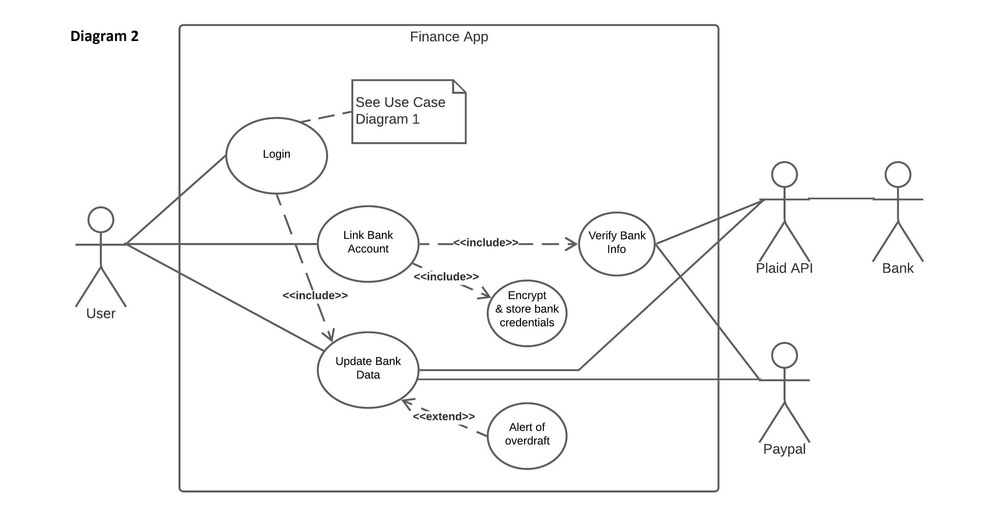

# Milestone 1: Requirements

## Product Description

Our product is a personal finance application that allows users to securely access several bank accounts and PayPal all in one place. After creating an account with our platform, users can link their bank accounts and their PayPal account. The users will also be given an option to auto-login in which case the login info to their financial institutions will be securely stored for easy login so they never have to worry about separately logging into their respective financial institutions ever again.

Once connected with a bank account users will be able to filter and view their transaction data going back 12 months. In addition to this, the system will also provide users an easy way to keep track of available funds to help users avoid overdraft fees. In addition to bank accounts, users can also keep track of their PayPal account. Our current plan is to provide users with a centralized hub to track all of their finances. In the future, we plan on implementing functionality to allow users to pay bills, and transfer funds between accounts through our service.

In addition to the ability to check account balance and up to 12 months of transaction data, our application also allows users to create a custom financial plan. Users can use this feature to create monthly/yearly budgets and keep track of their long term or short term financial goals. Future plans include providing users with financial education resources and news. To help users come up with a solid plan the notes section will offer financial information from reputable financial educational websites such as Investopedia. Users will also have access to a customizable news feed where they read the latest articles on topics such as personal finance, real estate, business, and investing.

Since financial management includes more than just bank accounts and money we also have plans in place to implement a stock portfolio tracker and a tracker for other assets such as gold, real estate, and crypto. This is a fairly long term goal which might be incorporated if the aforementioned features are successfully implemented. 

Our target audience for this product is the general public. More specifically we believe we can really help young people manage their finances in a meaningful way. Financial literacy is an essential skill and our application aims to help you lead a more financially conscious life. This tool can also be very helpful for the elderly as it allows users to combine all their bank accounts in one place. This quality of life improvement is especially beneficial for the elderly because they are most likely to have more than one bank account. Once we add our stock portfolio and assets tracker, our application would also be a great tool for new and veteran investors. The ability to manage finances, stock investments, and other assets all in one place is extremely powerful and can be utilized by everyone.

In order to achieve all of the aforementioned functionalities, we will be using several different technologies in conjunction. Our application will be programmed using python. One of the main features of connecting bank accounts to our platform will be facilitated by the Plaid API. Plaid API allows us to securely connect to several Canadian Financial institutions. Additionally, to implement the financial planner we will use NEWS API to get meaningful news articles to display to the user. To implement the stock portfolio and assets tracker, we will make use of APIs such as IEX Cloud and WealthSimple API. IEX cloud provides real-time stock market data and quotes for stocks along with a plethora of other useful information. Wealthsimple API would be utilized to connect to the user WealthSimple trade account so they can view their stock portfolio through our application. Along with all of this, we will use several other python libraries to help us build the system. For instance, we will utilize TKinter to develop the GUI for our application.

## List of Requirements

**Must Have Features**

- Login and Account Creation capabilities.
- Ability to connect to the top 4 Canadian banks (RBC, Scotia, TD, CIBC).
- Ability to check account balance.
- Encryption to store and manage sensitive user credentials.
- Ability to view the last 12 months of transaction activity for connected accounts.
- Ability to connect to and manage PayPal account.
- Users should only have to log in to each of their bank accounts once using the application.
- Transaction and balance data should update when the user logs in and allow on-demand refreshes afterward.
- APIs should be obfuscated from the user.
- Load time for pages must be less than 2 seconds.
- The program should run off of an executable.

**Should Have Features**

- Alert the user if an overdraft has occurred.
- Ability to track all user subscriptions.
- Users can attach notes to transactions.
- Provide a workspace for users to plan out financial strategies.

**Could Have Features**

- Stock Portfolio manager.
- Ability to track additional assets such as gold, real estate, vehicle(s), Crypto, etc.
- Ability to pay bills and transfer money.
- Add messaging functionality between users that share bank accounts.
- Displays user-customized news feed.

## List of Actors, Scenarios, and Use Cases

**List of Actors**
- User
- Plaid API
- Bank Institutions
- PayPal
- Financial App System

-----------------------------------------------------------------------------------------------
**Use case 1.0	Check balance in bank**

Primary actors:	User
		system
		PlaidAPI
		Bank

Preconditions:	A network connection is active.
		A bank account exists to connect to.

Flow of events:
1.	User signs into account.
2.	User selects bank to access.
3.	PlaidAPI request to the bank is sent using bank credentials.
4.	User is validated.
5.	Data is retrieved from the bank.
6.	Balance is shown.

Alternate Flows: 
1a.	User creates an account. 
2a.	User adds a bank to the app for future use. 
4a.	User credentials are invalid, given an error message. 
6a.	A warning is shown along with the balance if there is an overdraft in the account balance.

-----------------------------------------------------------------------------------------------
**Use case 1.1	Check transactions in bank**

Primary actors:	User
		system
		PlaidAPI
		Bank

Preconditions:	A network connection is active.

Flow of events:
1.	User logs into the application.
2.	User navigates to the transactions page.
3.	User selects the bank account for which they wish to see transactions.
4.	User specifies the time range for which they wish to see transactions.
5.	User adds a note to a specific transaction for future reference.

Alternate Flows: 
1a.	User creates an account. 
1b.	User adds a bank to the app for future use. 
1c.     User's bank credentials are validated by the bank and Plaid API. 
1d.	User credentials are invalid, given an error message.

-----------------------------------------------------------------------------------------------
**Use case 1.2	Check the balance in Paypal**

Primary actors:	User
		system
		Paypal

Preconditions:	A network connection is active
		A Paypal account exists to connect to

Flow of events:
1.	User signs into account.
2.	User chooses to use Paypal.
3.	Request to Paypal is sent using Paypal API.
4.	User is validated.
5.	Data is retrieved from Paypal.
6.	Balance is shown.

Alternate Flows: 
1a.	User creates an account. 
2a.	User adds a Paypal account to the app for future use. 
4a.	User credentials are invalid, given an error message.

-----------------------------------------------------------------------------------------------
**Use Case 1.3 Create Financial Plan/Access news articles and financial literacy material**

Primary actors:	User
		system

Preconditions:	The user has created an account with the platform and is logged in.

Flow of events:
1.	User navigates to the financial strategy page.
2.	User selects to create a new note.
3.	User adds whatever information they wish.
4.	User reads the latest news articles presented on the page.

Alternate Flows: 
1a.	User interacts with financial literacy resources available on the strategy page. 
2a.	User reads news articles presented on the strategy page. 
4a.	User filters new articles presented on the strategy page as per their preferences.

-----------------------------------------------------------------------------------------------

**Scenarios**

1.	User logs into the application.
2.	User chooses a bank/PayPal to link.
3.	User views the balance of the linked bank/PayPal account.
4.	User views the transactions of a linked bank account.
5.	User attaches a note to a specific transaction.
6.	User manually refreshes the page to see an updated balance.
7.	User creates notes containing financial plans and goals.
8.	User reads articles presented on the financial strategy page.

## UML Use Case Diagrams

[UML Use Case Preliminary Diagram](uploads/c6eb5dfa5e337c4d1d98ac056329bf30/CMPT_370_UML_Use_Case_Diagram.jpeg)

