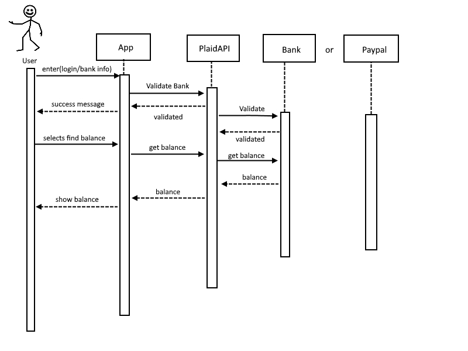

# Due Oct 19th

## Storyboards

Storyboard for Use Case 1.0 - 1.3:
- 1.0 - Check balance in bank
- 1.1 - Check transactions in bank
- 1.2 - Check the balance in PayPal
- 1.3 - Create Financial Plan/Access news articles and financial literacy material

**Sequence Diagrams**

System Architecture
-Layered architecture style

Persistent Storage details
-one database one application setup