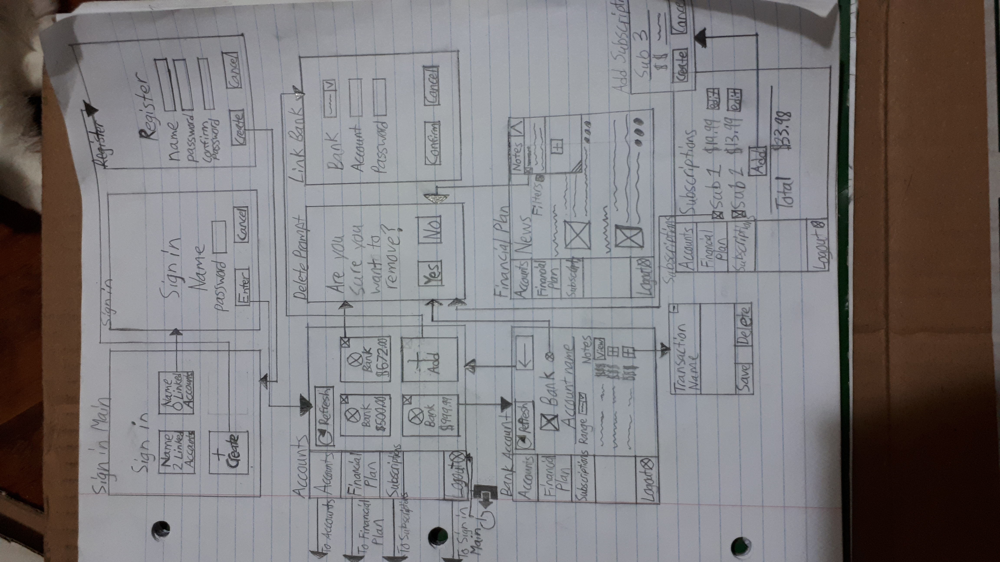
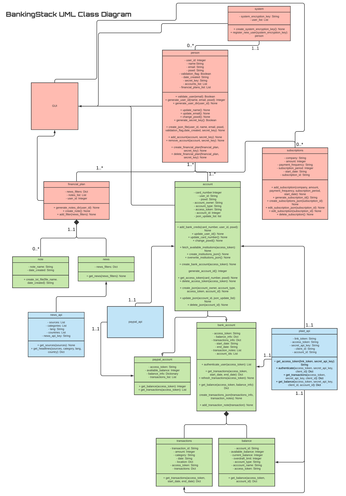
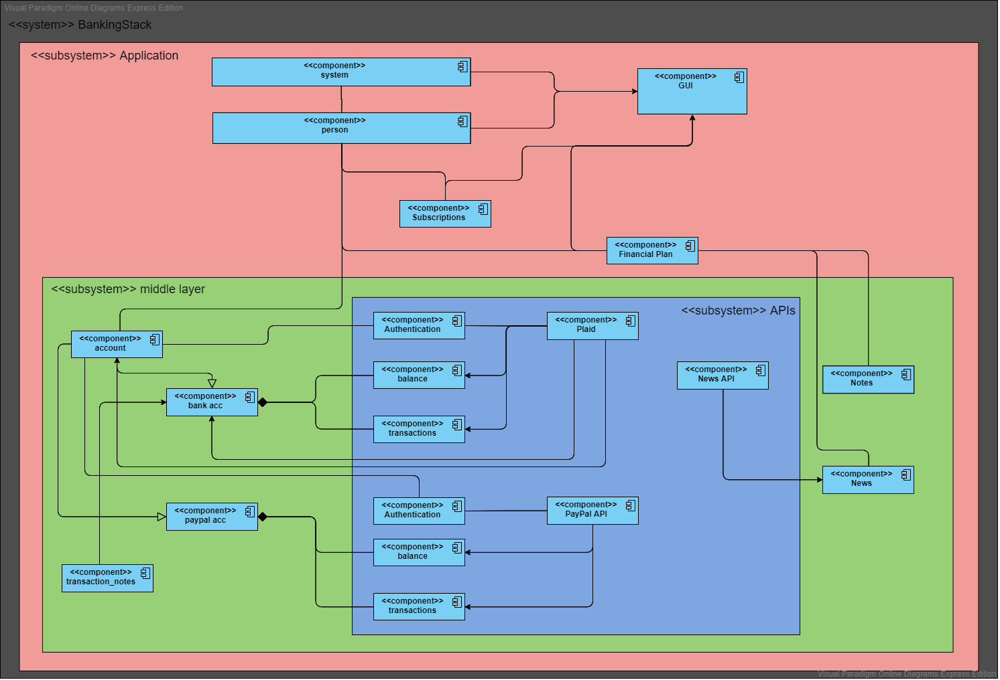
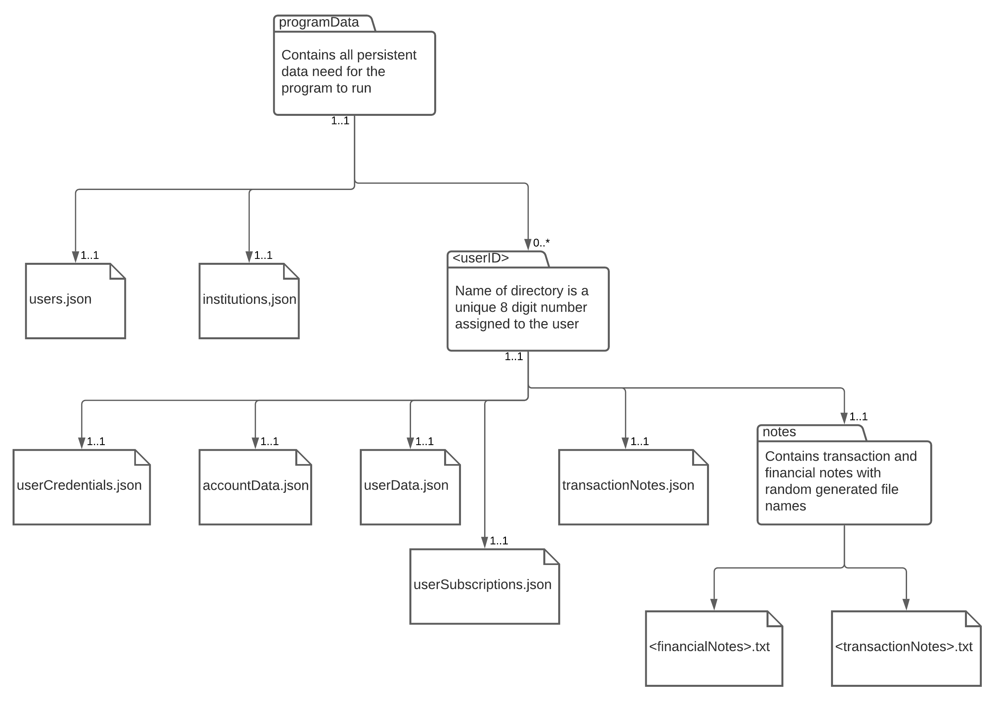

# Milestone 2: Design

# Storyboards

Storyboard for Use Case 1.0 - 1.3:
- 1.0 - Check the balance in the bank
- 1.1 - Check transactions in the bank
- 1.2 - Check the balance in PayPal
- 1.3 - Create Financial Plan/Access news articles and financial literacy material



# Domain Models


The Paypal API class has not been elaborated upon because after some extensive research into the Paypal API we have realized that implementing the features we wish to have might not be possible via the API. Further investigation is being done on this matter and as of now, the PayPal feature has been moved to the could have features list.

The details of the GUI class are not presented since we are still in the process of figuring out the exact inner workings of the GUI.

# System Architecture Details

## System Architecture
In order to implement our system, we decided to go with layered system architecture. The main reasoning behind this choice is to ensure that the API functions and the inner workings of the system are obfuscated and hidden from the user. We also believe that this system approach meshes well with our design because in some sense the APIs which handle the bank connections and data retrievals could be considered the core of our system.

As you can see in the class diagram there are three different colours of classes. Each colour essentially represents a layer. The blue layer consists of the APIs. This is the innermost layer of the system. Next up there are the green classes that represent the middle layer of the system. Lastly, there are the red classes that represent the outermost layer. 

Let us start from the outermost layer. This layer consists of the system, person, and financial_plan class. In this layer, the classes essentially account for all the functionalities that the user has access to. Things like add/remove an account, register with the platform, create a financial plan, etc. are presented here. The purpose of these classes is to contact the classes in the middle layer to reach the final API layer. The subscription class is also part of this layer and it provides the users the ability to add, edit, and delete their subscriptions so they can track that information using our platform. This layer also contains a GUI class that will handle the displaying of all the necessary information that will be fetched from the other top layer classes.

The middle layer provides the connection between the outer and innermost layers. This layer consists of classes such as notes, bank account, PayPal account, transactions, balance, etc. The main job of this layer is to breakdown the different user functions into several distinct categories so then those categorical functions can connect with the API efficiently. This allows the program to only obtain data requested by the user without fetching unnecessary data. For instance, the account class is broken up into a bank account and a PayPal account. Furthermore, the bank account class is broken down into transactions and balances. 

Finally, we have the innermost layer of the system which consists of the API classes. This class is the furthest from users. This class will essentially be accessed by the specific middle layer classes to obtain the necessary data. For instance, you can see that the plaid API connects to the account, bank account, transactions, and balance classes. That is because the account class has an access token variable which is obtained from plaid API using get_access_token() and also the fetch_available_institutions(), and create_bank_account() also communicate with the plaid API. The main reason the Plaid API class connects to the bank account class is to authenticate the user. Transactions and balance classes connect to the plaid API to get the respective data. Similarly, the PayPal API also connects to the PayPal account and accounts class so the access token can be obtained, and also the balance and transactions can be obtained. There is also the news API that exists in this layer. Unlike the other two APIs, this one is fairly straightforward.

Component Descriptions:
-	System: This class is responsible for creating the new user and creating the system encryption key. This class will communicate with the GUI class to display the corresponding windows for registration, login, etc.
-	Person: This class is responsible for the validation, and JSON file creation for a user profile. This class validates the user by sending them a verification email. It also handles the update user information and the user secret key generation. This user secret key is used to encrypt this particular user’s data. It also has the functionality to add accounts for a specific user. It also allows users to create a financial plan. Financial plan creation is essentially the user specifying his/her news filter preferences and also gives them the ability to add notes. This class also communicates with the GUI class.
-	Subscription: This class is responsible for managing user subscriptions and also is responsible for creating the correct JSON storage files for the subscriptions. It also connects with the GUI to display the corresponding information when necessary.
-	bank_account: This class authenticates the user's bank account and it also connects with the balance and transaction classes to get that information via functions such as get_transactions, refresh_transactions, and get_balance.
-	Plaid API: This class is responsible for obtaining an access_token for a specific bank account which is why it connects to the account class. It also provides authentication, transactions, and balance to the bank_account, transactions, and balance classes.
-	The rest of the classes are fairly simple and functions are easy to determine based on the UML class diagram.


## UML Component Diagram


# Interaction Diagrams

# Sequence Diagrams


# Persistent Storage Details

Persistent Storage details
-one database one application setup

The persistent storage for the finance tracker program is based on a hierarchy of encrypted and unencrypted JSON files. The encrypted files can be broken down into two categories, general encryption, and user-specific encryption. Files with general encryption contain less sensitive or administrative data and are encrypted/ decrypted using a general key that is known by the application. User-specific encryption is for any file containing sensitive user information such as an API access token, this data is encrypted with a user-specific key which can only be accessed with the general application key. The structure in the JSON files is that the "users.json" file which contains all the users and their one-time randomly generated associated directories will be generally encrypted.

In each user's directory are a series of JSON files containing data specific to that user as well as text files containing user notes created through the programs provided interface. The JSON files are, "userCredentials.json", "accountData.json", "userData.json" and "userSubscriptions.json" in addition there is a directory for the txt files called notes. The "userCredentials" is a generally encrypted file containing the user's name, password, email, their specific encryption key, and any other administrative data that might be needed. After successfully checking the user's password the program retrieves the key and uses it for encrypting and decrypting all of the other files contained in the user's directory. Next "accountData" is used to store the information for all of the user's associated accounts. This information includes bank name, account id, account owner, API access token, and the account type. This data is primarily used with the PLAID and PayPal APIs. The "userSubscription" file simply contains a list of subscriptions and their specific costs, payment intervals, subscription period, and start date for use in the program's subscription tracking service. The "userData" file is simply used to keep track of the user's selected news filters and point to the location of the text files containing their notes so that the program can open them for the user to access. The final encrypted JSON file is "transactionNotes" This file stores an association between a specific transaction and it's pinned note and provides the path to that note so the program can open it for the user and display its association.

The only unencrypted file is the "institutions" JSON file which simply contains the information on each institution that the plaid API needs in order to set up its tokens, This file will be updated at run time to check if the institutions initially provided for by the program are still supported as well as to check if any of the PLAID connection data has been changed.

**Persistent file storage hierarchy diagram:**



**JSON file examples:**

users.json:
```json
{
  "users":[
    {
      "username": "Steve105",
      "path": "C:\Programs\fintracker\data\10928324\"
    },
    {
      "username": "tempuser360",
      "path": "C:\Programs\fintracker\data\34937823\"
    },

  ]
}
```

institutions.json:
```json
{
    "institutions": [
        {
            "country_codes": [
                "CA"
            ],
            "has_mfa": true,
            "input_spec": "fixed",
            "institution_id": "ins_39",
            "mfa": [
                "code",
                "list",
                "questions",
                "selections"
            ],
            "mfa_code_type": "numeric",
            "name": "RBC Royal Bank",
            "oauth": false,
            "products": [
                "assets",
                "auth",
                "balance",
                "transactions",
                "income",
                "identity"
            ],
            "routing_numbers": []
        },

    ],
    "request_id": "xxxxxxxxxxxxx"
}
```
userCredentials.json:
```json
{
      "username": "Steve",
      "name": " John Smith",
      "email": "jsmith@mail.com",
      "password": "hellowworld",
      "validation": TRUE,
      "creationDate": "15/10/2020",
      "secretKey": "6EB29Z7",
  }
```

accountData.json:
```json
{
  "accounts": [
  {
    "accountID": 123456,
    "accountOwner": "John Smith",
    "bankName": "name",
    "accountType": "Chequing",
    "accessToken": "TEMP1",
  },
  {
    "accountID": 654321,
    "accountOwner": "John Smith",
    "bankName": "RBC Royal Bank",
    "accountType": "TFSA",
    "accessToken": "TEMP2",
  }
]
}
```

userData.json:
```json
{
  "countryfilter": ["Canada","USA","Germany"],
  "topicfilter":["technology","agriculture"],
  "financialnNotes":["C:/path-to-fnote1","C:/path-to-fnote2","C:/path-to-fnote3"],
}
```

transactionNotes.json:
```json
{
  "transactions": [
    {
      "accountID": 123456
      "data": [
        {
          "tID": "transaction1"
          "noteFile": "path-to-tnote1"
        },
        {
          "tID": "transaction2"
          "noteFile": "path-to-tnote2"
        },
      ]
    },
  ]
}
```

userSubscriptions.json:
```json
{
  "subscriptions": [
    {
      "company": "tempcompany1",
      "dollarAmount": 15,
      "interval": "Monthly",
      "subscriptionPeriod": 10,
      "startDate": "10/09/2020"
    },

  ]
}
```