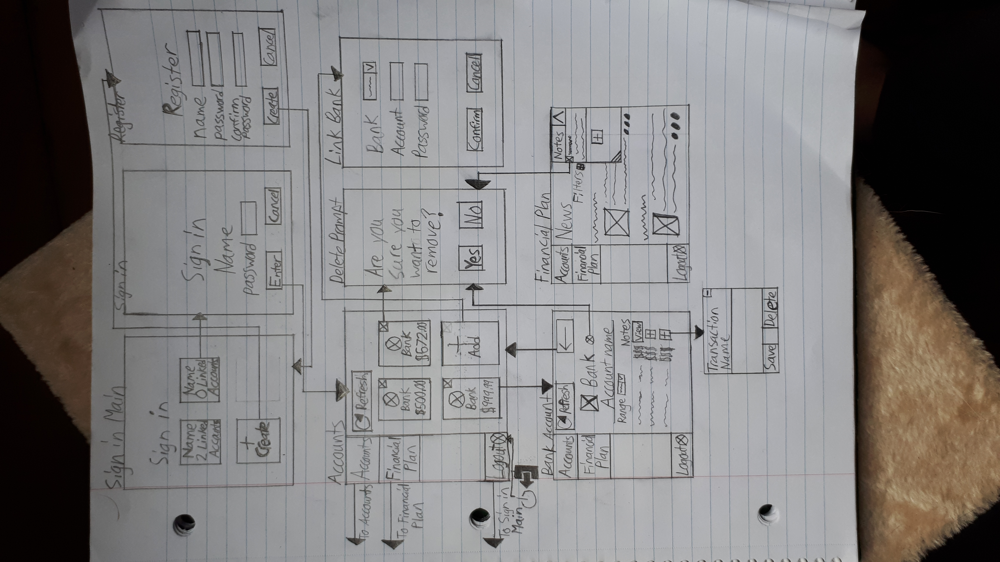
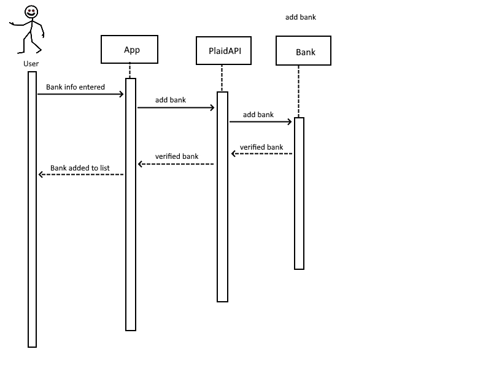
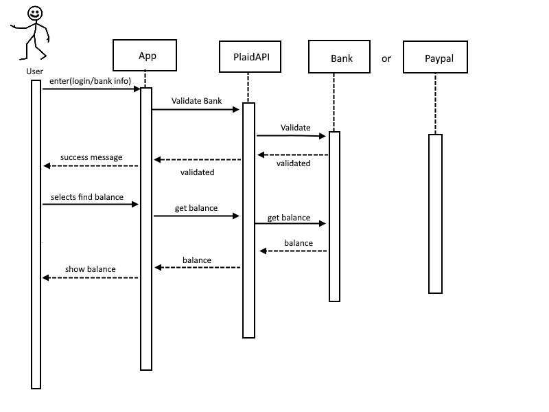
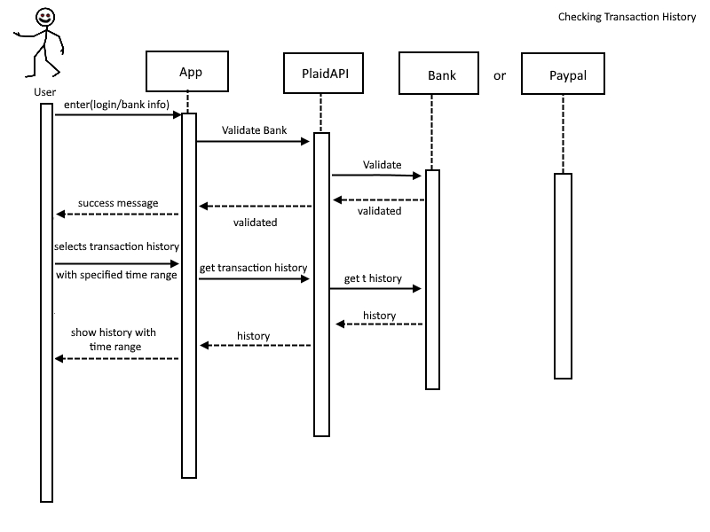
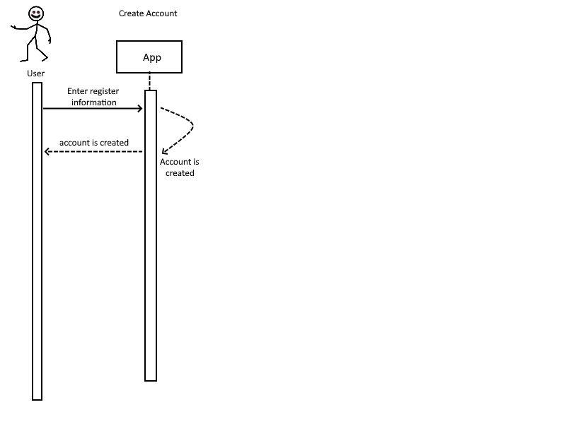
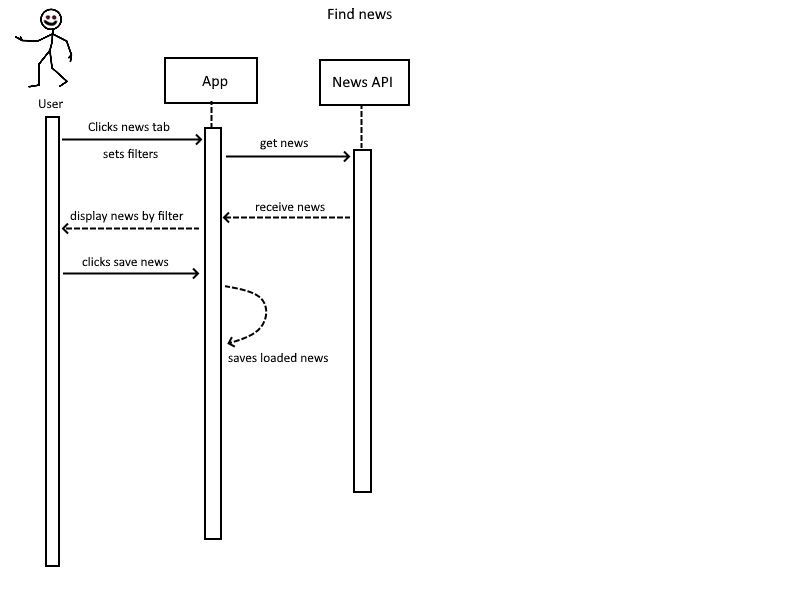

# Due Oct 19th

# Storyboards

Storyboard for Use Case 1.0 - 1.3:
- 1.0 - Check balance in bank
- 1.1 - Check transactions in bank
- 1.2 - Check the balance in PayPal
- 1.3 - Create Financial Plan/Access news articles and financial literacy material



# Domain Models

# System Architecture Details

System Architecture
-Layered architecture style

# Interaction Diagrams

**Sequence Diagrams**












# Persistent Storage Details

Persistent Storage details
-one database one application setup

Persistent file storage hierarchy diagram:


Below are some examples of what the JSON files used to store the persistent data will look like.

users.json:
```json
{
  "users":[
    {
      "username": "Steve105",
      "path": "C:\Programs\bankecon\data\10928324\"
    },
    {
      "username": "tempuser360",
      "path": "C:\Programs\bankecon\data\34937823\"
    },

  ]
}
```

institutions.json:
```json
{
    "institutions": [
        {
            "country_codes": [
                "CA"
            ],
            "has_mfa": true,
            "input_spec": "fixed",
            "institution_id": "ins_39",
            "mfa": [
                "code",
                "list",
                "questions",
                "selections"
            ],
            "mfa_code_type": "numeric",
            "name": "RBC Royal Bank",
            "oauth": false,
            "products": [
                "assets",
                "auth",
                "balance",
                "transactions",
                "income",
                "identity"
            ],
            "routing_numbers": []
        },

    ],
    "request_id": "xxxxxxxxxxxxx"
}
```
userCredentials.json:
```json
{
      "username": "Steve",
      "name": " John Smith",
      "email": "jsmith@mail.com",
      "password": "hellowworld",
      "validation": TRUE,
      "creationDate": "15/10/2020",
      "secretKey": "6EB29Z7",
  }
```

accountData.json:
```json
{
  "accounts": [
  {
    "accountID": 123456,
    "accountOwner": "John Smith",
    "bankName": "name",
    "accountType": "Chequing",
    "accessToken": "TEMP1",
  },
  {
    "accountID": 654321,
    "accountOwner": "John Smith",
    "bankName": "RBC Royal Bank",
    "accountType": "TFSA",
    "accessToken": "TEMP2",
  }
]
}
```

userData.json:
```json
{
  "countryfilter": ["Canada","USA","Germany"],
  "topicfilter":["technology","agriculture"],
  "notes":["C:/path-to-note1","C:/path-to-note2","C:/path-to-note3"],
}
```