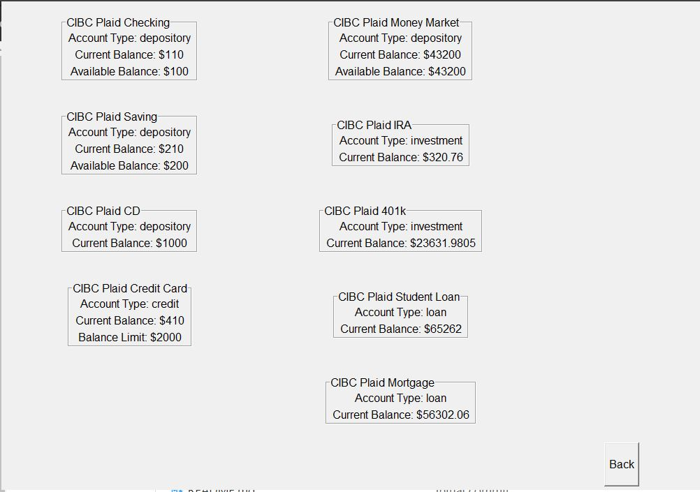
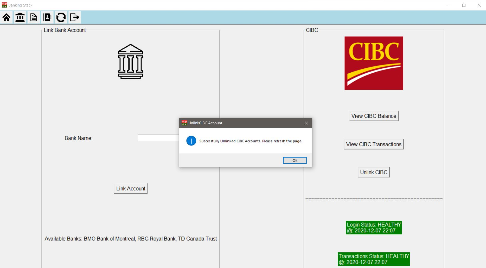

# User Documentation
## As-Built Product Description

### Introduction
There are essentially four key components in our system. Each component has been completed to varying degrees. The next few paragraphs will provide a functional description of the product at the current stage. First up we will discuss the login/register component, next is the bank accounts component, after that we will discuss the financial plan component, and lastly, we will discuss the subscriptions component.

### Login/Register
Upon launching the program, users will be met with the login/register screen.  Selecting the register button will prompt the user to enter a name, username, email, and password.  After the app receives the input from the user it will verify first that the input values are of an acceptable format before proceeding with registering the user.  The app will also verify that a user doesn’t already exist with the input username.  Registering the user consists of generating a directory for the user’s individual files to be stored, recording the user and it’s directory path in users.json, and recording the user’s input credentials for verification in usersCredentials.json.  After successfully registering the user can now select login and enter the credentials they registered with.  The app will check if the username exists and if so will then verify the password.  If all the checks pass then the user will be logged in and a new screen will open displaying the user’s main screen.

### Account Balance
Currently, the features that are working for the accounts page are:

**Link Account**
Allows users to go through the plaid weblink to link to a bank account. There is no need to use real credentials to login with your actual bank instead the sandbox mode does a great job in providing realistic data that allow us to test the features.

**Check Balance**
The check balance feature allows the user to check the balance for all of their accounts under a certain bank. for instance, a typical user might have a checking, saving, and credit account with a bank. they would be able to see the balance for all three in this window. They can also see the overdraft limit for a credit account. 

**View Transactions**
The view transaction window requests the user to select a time range with a maximum of one year. This is done by getting the user to select a start and end date. The user is also requested to select the account for which they wish to see transactions since it wouldn't make sense to display transactions for all accounts mixed together.

**Unlink Account**
This simply removes the user's account from our system and invalidates the token used to access their account via plaid. The user will have to relink the account if they wanna see the data for it again.

**Login and Transactions availability status**
This feature is to help the user quickly figure out whether they can connect to their bank. A message is shown under the unlink account button showing the status of Plaid's connection with that bank. If the status is UNHEALTHY then the connection might fail. 

### Financial Plan
For the financial plan, if the user clicks on the financial plan icon button, a new window will pop out. Inside the newly pop window, a list of buttons will be shown, the buttons are different functions for users to interact with the system. For example, users can add a new note and save the data into a .json file. The key, title and content of the notes and news filter which are saved by the user will be shown in the top section of the window. Nothing will be shown if there is no note or news saved by the user.
The first button will be adding a new note. After the user has clicked the button, a new sub window will pop out and ask the user to enter the title and the content for their new note. After the submit button is clicked, the note will be stored in a .json file, a key will be generated and given to it, the sub window will be destroyed by the system and back to the menu and.
The second button will be editing the existing note. After the user has clicked the button a new sub window will pop out and ask the user to enter the key for the note that the user wants to edit, the new title they wish to change to and the new content of the note. After the submit button was clicked, the title and the content of the specific note will be replaced by the new one. After the submit button is clicked, the note will be created, and the sub window will be destroyed by the system and back to the menu.

The third button will be deleting the existing note. After the user has clicked the button a new sub window will pop out and ask the user to enter the key for the note that the user wants to delete. After the submit button was clicked, the specific note will be removed from the .json file and will not be shown in the note display section.
The fourth button will be adding the news filter. After the user has clicked the button a new sub window will pop out and ask the user to enter the key words or the title of the news. After the user has submitted it, a new sub window will pop out and the old sub window will be destroyed. The new sub window will be showing a list of 20 news titles and a box for the user to enter the index number of the title they wish to add. After that, the sub window will be destroyed and the news which the user selected will be stored in a .json file, and inside it contents all the data and a newly generated key for each of the news added.

The fifth button will be editing the news filter, After the user has clicked the button a new sub window will pop out and ask the user to enter the key for a specific news filter. After that a new window will pop out and prompt the user to enter the key words or the title of the news they want to search for. After the user hits the submit, the previous window will be destroyed and a new window will pop out. Inside the new sub window, a list of 20 news titles will be shown to the user, there is a box for the user to input the index number of the news title underneath the list of news titles. After the user selected and submitted the index number of the news title, the sub window will be destroyed, then the new title and the new content will replace the old data inside that specific news filter.
The sixth button will be the back button, which will destroy the current window and get back to the main menu after the logging session. 
 
### Subscriptions
The forth icon on the top task bar takes you to the user subscriptions page four options are available; Add Subscription, Edit Subscription, Delete Subscription and List Subscriptions. Selecting Add Subscription will open a new window with the subscription options and to add those options or to cancel and return to the previous menu. Selecting Edit Subscriptions will open a similar window to add except you will enter new values for an existing subscription. You will need the id of an existing subscription, which can be found in List Subscriptions, and all of the new values you would like to update, even if they are the same you need to enter them in again. Selecting Delete Subscription will open a new window with the option to enter a subscription id to delete that subscription. Selecting List Subscriptions will open a new window that displays all subscriptions and their values.

## Usage Instructions

In order to successfully verify the features that our product boasts, there are a few key pieces of information that you must know. The main file in our system is the loginRegisterGUI.py. This file contains the entire GUI for the system. The first thing to keep in mind is that, in order to ensure security while using the system we have forced the system into sandbox mode. All features can be accurately verified in sandbox mode without using real banking credentials.

When you first run the GUI. There won't be any registered user and so the most obvious first step is to register yourself. When you register the form will ask you to provide a name, username, email, and password. If the register is unsuccessful a pop window will notify you of the error. If it is successful you will automatically go back to the main window.
You will now be able to click login and enter the credentials you just registered with.

Once you login, you will see the welcome page. This is the system homepage. On the homepage you will see some instructions which talk about what each button in the toolbar does. Additionally, hovering over the toolbar button will also provide a name of the feature it leads to.

Once you reach the accounts page you will see a rectangular outline around an input bar. Here you can enter one of the bank names listed below to begin the linking process with that institute. Clicking Link Account will open the Plaid linking web page in your default browser. On the webpage you will have to click the button to begin the linking process. 

Finally, once you reach the page where you enter the bank credentials to link the account, please enter the following credentials. 

_username/clientID = user_good_

_Password = pass_good_

This information is also provided on the bottom of the webpage. Once the linking process is complete you can close the webpage and return to the bankingStack GUI. Once you are there you will have to refresh the page by clicking the refresh icon in the toolbar. Then you will see the newly linked bank account.

To check balance or transactions you can click on the corresponding buttons. The transactions will open a page that will request some information. Information such as which account you want to view transactions for, end date (later date) and start date (earlier date) for the range of time you want to see transactions for. Then you can click on View Transactions to see the list of transactions. There is a bug in this portion that is discussed in the bugs sections.

The unlink account process is simply clicking the button.
The rest of the GUI is fairly straightforward. However, we have attached some screenshots for your reference. Here are some important pointers.

- On the notes page once you add a note you must click on the notes icon in the toolbar to refresh the page.
- In order to edit a note you will need the note key. Which can be seen on the notes page right above the title of the note.
- On the add new subscriptions screen you can enter the sub start date in any format.
- The period input under add new subscriptions can be any integer
- In order to delete or edit a subscription you will need its ID which you can find in the table by clicking on the view subscriptions button.

Login/Register Page

Register Page

Login Page

Home Page

Plaid Web Link

Plaid Bank login info page

Plaid Successful Link Page

Accounts Page

Account Balances Page

Transactions settings Page

Transactions List Page

Unlink account success prompt

Financial Plan / Notes Main Page

Add Note Page

Edit Note Page

Delete Note Page

Add News Filter

Select article to save

Subscriptions Main Page

Add Subscriptions Page

List Subscriptions

Delete Subscription

Edit Subscription

## As-Built Requirements

In our Milestone 1 document we specified a few things that are not consistent with our final product.  We originally planned to include the functionality to link a Paypal account to our system but we abandoned the idea due to time constraints and the PayPal api being directed towards vendor transactions rather than our intended purpose.  We also planned to have an auto login feature to stay logged in to your linked banks but at the time we didn’t understand the plaid api or how everything was going to fit together.  Our program does not store user’s bank credentials, all the data we store from linking the bank is an access token that we acquire from the plaid api after it has verified that the user’s bank credentials are valid.  We also specified that we would use Tkinter to create our GUI but we actually have used a wrapper around Tkinter, appjar.  
Some of our should have and could have features did not make it into the final product.  These features include the ability to attach notes to transactions, as well as no stock portfolio features were implemented nor were any asset trackers.

# Programmer Documentation
## Compilation Instruction

[README](https://git.cs.usask.ca/CMPT370-01-2020/group9/-/blob/master/README.md)

First, you will need to install the third-party libraries that we used in our project.  To do so, in the terminal navigate to the directory that contains our project files including requirements.txt.  You can use pip to install the third-party libraries we used with:
pip install -r requirements.txt

After installing the third-party libraries you can run our project simply by executing:
python loginRegisterGUI.py

### 3rd Party Libraries

Plaid 7.1.0 -- https://plaid.com/docs/ 
The Plaid API was used as an intermediary between our platform and the four supported institutions. The API allows us to obtain a user’s banking information such as account balances and transactions without worrying about storing a user's sensitive data.

Cryptography 3.2.1 -- https://cryptography.io/en/latest/# 
The Python Cryptography library was used to encrypt/decrypt the users balance and transactions data. It was also used to encrypt user credentials and the api credentials.

News api 0.2.6 -- https://newsapi.org/docs 
The News API was used in the financial plan component of the system to obtain news articles based on a user search filter. We used the API to obtain a fixed number of articles based on a user entered filter. The user was then given the ability to save the article URL on their financial plan page.

Tkinter skeleton AppJar 0.94 -- http://appjar.info/
AppJar was used to develop our GUI. It is a wrapper framework for Tkinter which makes it easy to use for smaller applications.
 
Python DateUtil 2.8.1 -- https://dateutil.readthedocs.io/en/stable/
The Python DateUtil library was used to handle some of the date and time objects used by the transactions, and balance components of the project.

There are several other libraries in our requirements.txt file however, those are all libraries used by the Plaid-python library. It does automatically download them when you get plaid-python but we included them just to be safe.

## Testing Documentation & Instructions
### How to Run tests
At the moment none of our tests are runnable. This is because of the drastic changes we made to the code in order to implement a GUI. The main reason behind this error is the fact we didn’t update the tests as the code changed. In hindsight we should have written tests as we developed code instead of creating tests at an early stage.

### Tested Parts of the System
As of the submission we have successfully unit tested all the functions for the following four components.

Encryption/Decryption
- The encryption and decryption of different strings json or otherwise
- The encryption and decryption of json and non strings was unit tested to ensure that the functions return the correct values (string is unchanged/correct after being encrypted and decrypted)and that the encryption/decryption functions cannot be passed an incorrect key without throwing exceptions
- These functions were some of the first built/unit tested due to their high rate of use in most other functions

Login/Register
- The login and register q
- All login/register functions along with the functions that handle creating user directory and files have been unit tested. In terms of integration testing for these functions, we did that manually using both the GUI and the command line interface which was used in the demo.
-The login and register testing was some of the earliest testing we did since this is the first thing the user interacts with and so it’s important to have these features working correctly.

Financial Plan/Notes
- Note and news filter functions 
- Did unit tests for each of the note and news filter function, integration and end-to-end testing wasn’t able to be done due to the amount of time we have is too packed.
- Tested add note function, edit note function, delete note function, add news filter function and the edit news function. Testing is done by checking whether it got the correct result as expected.

Subscriptions
- Add delete and edit subscription
- All the functions involved in manipulating the subscriptions json were unit tested. Testing was confirmed by opening the json and checking for the data to match what is expected.
Much testing was also done with terminal commands and gui as manual testing

### Untested Sections of the System and Future Testing plans
We have not done any automated testing for the GUI since no one in the group had experience with such tools and the time frame of the project couldn’t account for the time required to implement something for automated GUI testing. We did extensive hands-on testing for the GUI. We did find some bugs in the GUI which will be discussed in the known bugs section. In the future we might consider using some automated GUI testing frameworks.

As of the submission the main part that is not unit tested in the system is the plaid functions and the bank account related functions. These functions are crucial parts of the system however the current version doesn't have any formal unit testing because we had to make drastic changes to the functions in order to get them to work with the GUI. However we did do extensive manual testing to ensure the functions work and in that the overall system is not affected severely due to the lack of testing.
One of the reasons this lack of testing occurred is because we decided to develop the test cases and built the test cases before we began coding the actual functions and did not anticipate that issues regarding the GUI would arise and so the most preliminary test cases were practically useless. After that we ran out of time to create test cases for the banking functions.

If we were to continue development on this project our strategy in terms of testing would include the use of mocking to create user directories and files. These files would then be used in conjunction with unit testing and the plaid sandbox mode to thoroughly and automatically test each and every function that relates to the bank accounts features.

One of the key mistakes in our testing process was the fact that we wrote the tests before the functions. In reality this is a good programming practice. However, our design docs were not detailed enough for this to be a good option. We implemented many test cases and verified them but then last minute GUI implementations forced us to drastically change the code and this led to our test cases not being useful.

### Third Party Testing Libraries
We decided to use the Pytest python library for creating our unit tests. It seemed like a straightforward choice considering we used Python as our development language. The pytest framework provides ample features and is a testing framework. We only used it for our unit testing and didn’t get a chance to utilize some of its more powerful features.

Pytest 6.1.2 -- https://docs.pytest.org/en/latest/contents.html#toc

## As-Built Design
### Design Storyboards
The entire visual design of our project varies from our initial design storyboard.  We began to run out of time to finish our project and we encountered a time crunch when it came time to create our GUI.  We used a GUI library that was easy to use to get everything running in a short period of time but it’s also not very robust and we didn’t have a lot of control over the design.
### UML
We have some of the Class diagrams from our system however because most of our system is not in terms of classes we didn't get time to go back and manually create an updated UML diagram. 

### Persistent Storage Details

Naming Schemes changed during development as needed. The subdirectory for notes was also removed as only one note file was needed as the transaction notes feature was dropped from release. The APICrendentials.json file was added to store the necessary PLAID credentials needed to access the data. userAccounts.data was also added to hold a list of all accounts. All files except userSubscriptions.json, notes.json and news.json are encrypted and userAccounts.data and userCredentials.json are encrypted with a user specific key.
### StoryBoard

*Shown by the images in the program demo.

## Known Bugs, Incomplete Features, and Workarounds

Some of our Must Have Features we were unable to implement and they are:
Load time for pages must be less than 2 seconds.
The program should run off of an executable.
Displays user-customized news feed.
Transaction and balance data should update when the user logs in and allow on-demand refreshes afterward.

Load time for pages must be less than 2 seconds.
Our load times are not always under 2 seconds due to our reliance on all the data being passed to us through the apis every time we are gated by the user’s internet connection and the response time of the apis to respond with the data.

The program should run off of an executable.
We tried to make it so that our code would install and run from an executable but we ran into troubles making that happen near the end and we had to abandon this.

Displays user-customized news feed.
Our implementation of the user-customized news feed has partially been implemented however in its current state it is not really a feed but more so that we are presenting articles based on a search and the user can look more into an article on their own.

Transaction and balance data should update when the user logs in and allow on-demand refreshes afterward.
Transaction and balance data is not being stored locally as we originally thought so on login that data is not being received however when the user visits the appropriate tab for that information data will be received and displayed for the user.  The data can be refreshed by reloading that page.

Verifying user registration via an email verification was a planned feature and would have also been used to recover a user’s login credentials in the case that they forgot them however this feature also was not implemented due to time constraints.

At the moment none of our tests are runnable. This is because of the drastic changes we made to the code in order to implement a GUI. The main reason behind this error is the fact we didn’t update the tests as the code changed. In hindsight we should have written tests as we developed code instead of creating tests at an early stage.

Transaction viewing is finicky
- After linking a new account then you can view transaction once and if you try to view it again it will crash. The issue is caused by the way appJar handles frames and subwindows. This is one of the bad parts of appJar. The way to get around this is to just restart the program each time you view transactions.
